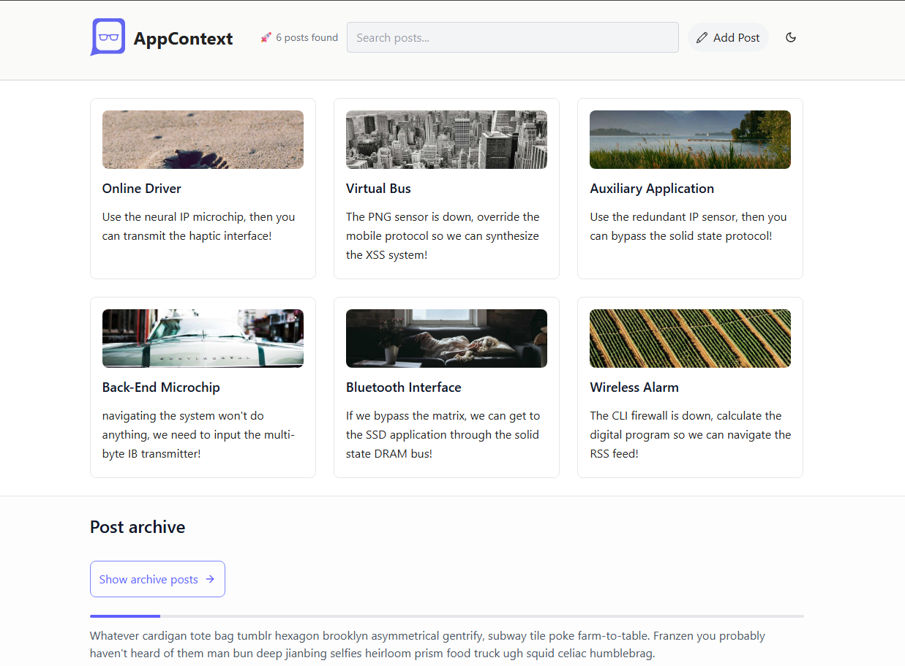

<h1>AppContext</h1>

https://app-contextt.netlify.app/

  This is a practice project in React that uses the "useContext" hook to solve the prop drilling problem and learn about global state management. 

## 👍 My Challenges:

- Tailwind CSS has been applied.
- The positions of the components were rearranged, and a modal pop-up feature was added for blog content.
- Improving many aspects of front-end design 🤗
- Special effort was made for responsive design.

## 🎉 Build With:

- React JS + Tailwind CSS
- Semantic HTML5 markup
- CSS Flexbox and Grid
- Mobile-first workflow
- Custom CSS properties
